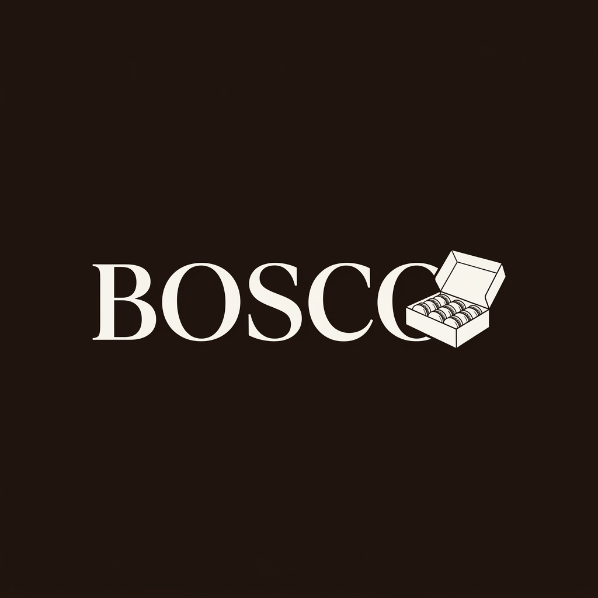

# BOSCO Edición 01 — High-End Editorial Landing Page



## 📌 Visión General
BOSCO Edición 01 es una landing page de alta autoridad para una marca premium de alfajores artesanales en Resistencia, Chaco. El proyecto fue desarrollado bajo los estándares de **Trama Studio**, buscando una estética de "Brutalismo Editorial" (inspirada en nudeproject.com) que prioriza la exclusividad, el coleccionismo y la trazabilidad del producto.

Este repositorio demuestra la capacidad de crear experiencias visuales de lujo utilizando un stack **"Vanilla First"**, priorizando el rendimiento nativo y el control total sobre la interactividad.

---

## 🛠️ Stack Técnico
Para este proyecto, decidimos omitir el uso de frameworks pesados para garantizar una carga instantánea y una estabilidad visual absoluta:

- **HTML5 Semántico**: Estructura optimizada para accesibilidad y SEO técnico (JSON-LD incluido).
- **Vanilla CSS3**: 
  - Sistema de tokens con Variables CSS.
  - Layout responsivo mediante `clamp()` y `grid` dinámico.
  - Uso de **Modern Viewports (`dvh`, `svh`)** para estabilidad en móviles.
- **Vanilla JavaScript**:
  - Sistema de animaciones basado en `IntersectionObserver` para una ejecución de 60fps sin carga de CPU innecesaria.
- **Performance Fixes**:
  - Implementación de `contain: paint` para aislamiento de layout.
  - Transformaciones 3D (`translate3d`) para aceleración por hardware.

---

## 🎨 Motion Design & Estética
Inspirado por el trabajo de **Emil Kowalski**, el sistema de movimiento de BOSCO no es decorativo, sino funcional:

1. **Staggered Reveals**: Los elementos entran en una secuencia rítmica que guía la vista del usuario (Logo > Hero > Nav).
2. **Buttery Easing**: Se utiliza una curva de Bezier personalizada (`0.16, 1, 0.3, 1`) para una sensación de fluidez orgánica.
3. **Tactilidad**: Cada interacción (hover/click) tiene un feedback físico mediante sutiles cambios de escala.
4. **Textura Cinemática**: Un overlay de "Grain" dinámico aporta calidez al modo oscuro, rompiendo la frialdad del flat design.

---

## 🚀 Desafíos Técnicos Superados
- **Layout Stability (CLS)**: Se resolvió la inestabilidad visual en la carga de tipografías pesadas y animaciones de entrada mediante reserva de espacios (`min-height`) y técnicas de contención.
- **Mobile UX**: Optimización del FAB (Floating Action Button) de WhatsApp para evitar solapamientos con el contenido crítico en pantallas pequeñas.
- **SEO de Autor**: Implementación de metadatos estructurados para posicionar la marca como un "Local Business" de lujo.

---

## 📁 Estructura del Proyecto
```bash
├── assets/             # Recursos visuales e iconografía oficial
├── index.html          # Estructura y metadatos SEO
├── style.css           # Sistema de diseño, tokens y animaciones
└── main.js             # Lógica de scroll y observadores de animación
```

---

## 👤 Autor & Agencia
Proyecto desarrollado para **BOSCO Argentina**.
Estudio: **Trama Studio**
Desarrolladora: [nadiaescobbb]

---

> [!TIP]
> **Nota para Reclutadores**: Este proyecto fue construido sin dependencias externas (0 libraries) para demostrar el dominio profundo de las bases de la web y la atención al detalle en la performance.
